# Sysmonster: the Sysmon Framework


## Purpose

Microsoft's Sysmon is an essential tool for security monitoring, but managing its XML configurations can become complex and error-prone. 
**Sysmonster** provides a powerful, PowerShell-based framework that shows configuration in both simple and advanced modes, trying to find misconfigurations that can be used by attackers.
Uniquely, it delivers the ability to completely silence Sysmon and all of its logs by silent mode (with 20+ Sysmon versions support!)

---
## Features

-   **Interactive CLI and Framework**: A central command-line interface provides easy access to all tools and functions.
-   **Silent Mode**: Silence Sysmon logs completely via registry, 20+ Sysmon versions support. Configuration can be reverted back to the original like nothing happened :)
-   **"High-Check" Misconfiguration Risk Analysis**: A unique feature to analyze your configuration in some events attackers can find the gaps, avoiding critical logs. 
-   **Live & Passive Configuration Analysis**: Investigating live configuration? you can run the tool in online mode and dump the configuration file. Not in the live machine but also want to analyze the configuration? offline mode is also supported :)
-   **Modular Architecture**: Functionality is cleanly separated into modules for processes (`ProcSysmonster.psm1`), files (`FileSysmonster.psm1`), and other (`OtherSysmonster.psm1`), events, making the tool easy to maintain and extend.

---
## Quick Start

### Prerequisites

1.  **Sysmon**: Must be installed on the target machine for online mode (and silent feature). 
   For offline mode you will get some errors for not finding Sysmon but you can use the tool for those checks.
2. **Sysmon Version**: 9.0 or newer (silent mode still works for older versions).
3.  **PowerShell**: Version 5.1 or newer.
4.  **Administrator Privileges**: Required for silent feature.

---
### Installation and Launch

1.  Open an **elevated PowerShell** terminal.
2.  Navigate to the project directory.
```powershell
   cd "c:\path\to\your\project\Sysmonster"
```
3.  If your script execution policy is restricted, you may need to allow the script run as scope as you want by `Set-ExecutionPolicy` function.
4.  Launch the main Sysmonster script!
```powershell
   . .\Sysmonster.ps1
```

After the ASCII art loads, you should now be in the `SYSMONSTER >` interactive prompt:

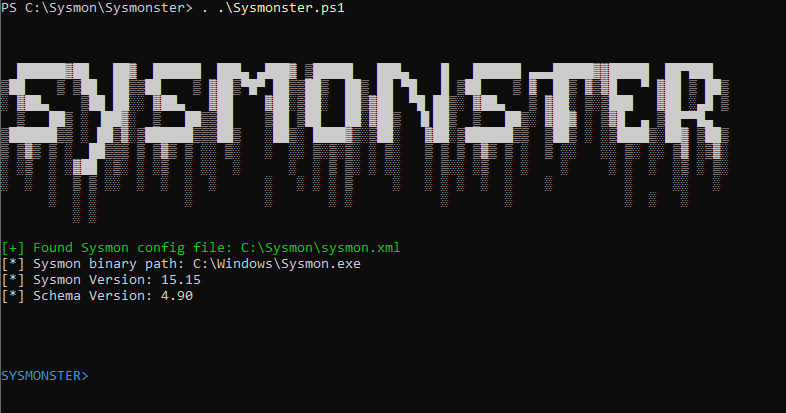

** The tool will try to find the Sysmon configuration path, the binary path, its version and its schema version.

---
## Usage

Once inside the Sysmonster CLI, you can use the help/?/h/menu commands for menu.

To use the framework, you should set three main parameters:
1. `set conf <config file>` - here you can set the live configuration file (which is directly written after the ASCII art), or any configuration file you want to investigate.
2. `set state <online/offline>` - choose in which state the tool runs. Pick online mode for analyze the current machine with the configuration file (query interesting paths/files/registry paths and values etc.). This mode is more noisy than offline mode. 
   Pick offline mode if you don't want to investigate the current machine (some advanced checks and silent mode will not work here).
3. `set event <all/number/number-range/some,events,seperated>` - after setting config file and state, choose the events you want to analyze. Don't remember events' numbers? It's OK, you have the command `get eventlist` that prints it all for you :)

   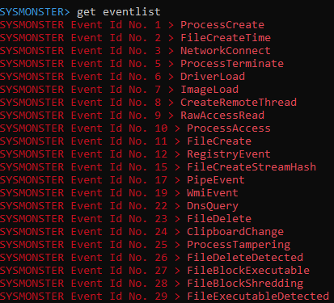

Usage example:

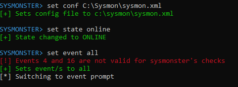

Don't waste time on the red message - it just says that event 4 (Sysmon service state changed) and event 16 (Sysmon configuration changed) do not have tool checks (therefore the tool skips them).

---
## Advanced Analysis

Once picked event/s, the tool continues to event prompt (e.g. `SYSMONSTER\1 >` for event 1). 
From now on, you can play with the tool and suggested checks (and also different help menu is available).

You can see each event checks from the `show options` command:

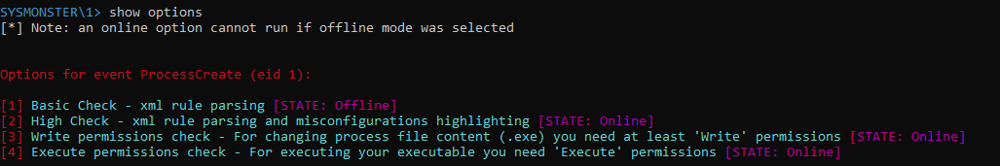

The main possible checks are:
- Basic check - default xml rule parsing (also complicated rules with 'and' chain), shows the rules in organized table.
- High check - misconfiguration highlighting of excluded rules. The tool shows the possible attack vectors and highlight interesting rules that can abused by attackers. If a "gap" in a rule presents, an attacker can abuse it for acting without logs.
- Moreover, some events have more external options to try (e.g. event 1 has option 3&4).

Usage example, trying high check analysis for event 1 against [the most popular Sysmon configuration](https://github.com/SwiftOnSecurity/sysmon-config/blob/master/sysmonconfig-export.xml) :


More attack vector presents, but we will focus with the one in the picture. After running, the table of the excluded rules is:

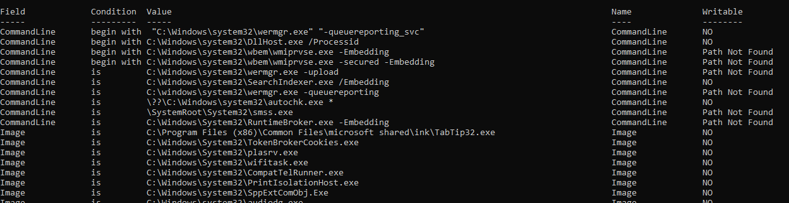

Note that you can see more columns moving right!

In the bottom of the table the tool marks three interesting rules, lets analyze them:


First, the three binaries are marked, but `OfficeC2RClient.exe` marked twice - that's because both Image and Parent Image are excluded! 
And what brings it interesting is that it has write & execute permissions for some users, written in the table:

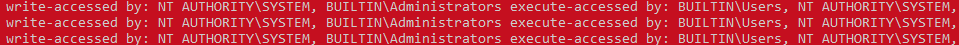
#### What does it mean???

It means that an attacker with write permission to `OfficeC2RClient.exe` can switch its content to `cmd.exe, powershell.exe` etc. and all its actions (Image is excluded) and also what it will run under itself (Parent Image excluded) will not be logged at all !!! 

** important note: it does not mean that all operations will be excluded (like network, registry etc.), you can figure it out searching the same binary in different events.
(In this case this binary shows more than one event, but I'll let you play with it for now ;) )

---
## Silent Mode !!!!

Sysmon has interesting registry value, located at `HKLM:\SYSTEM\CurrentControlSet\Services\SysmonDrv\Parameters -> Rules`. 

It contains binary value, for example:

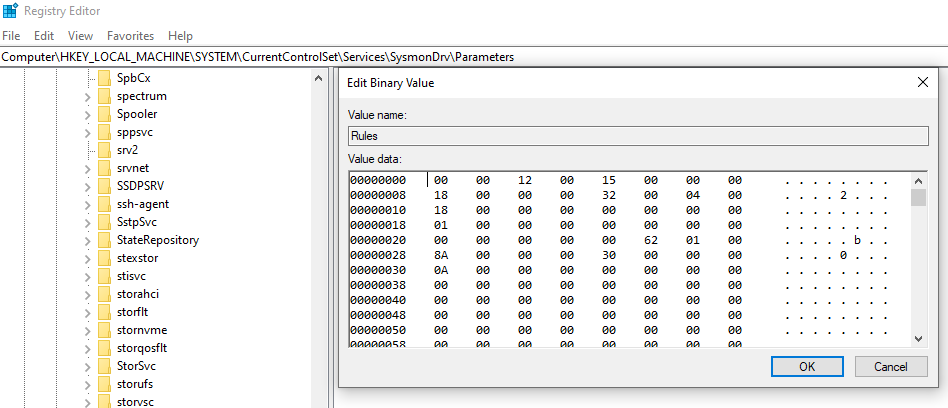

The way the binary value generated is not documented, but it doesn't matter for us. 
The tool has 20+ registry value, matching 20+ different Sysmon versions, that contains the value needed for "empty policy", means it loads policy contains no rules to include (everything is excluded). 
Once we use the `silent` command, the tool will choose the closest value needed for the Sysmon version running, and will update it. After that, no logs at all (no service restart required, immediately changes):

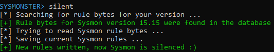

We can check from Sysmon itself (via `sysmon -c` command), and voilà! nothing logged (all events are rule empty):

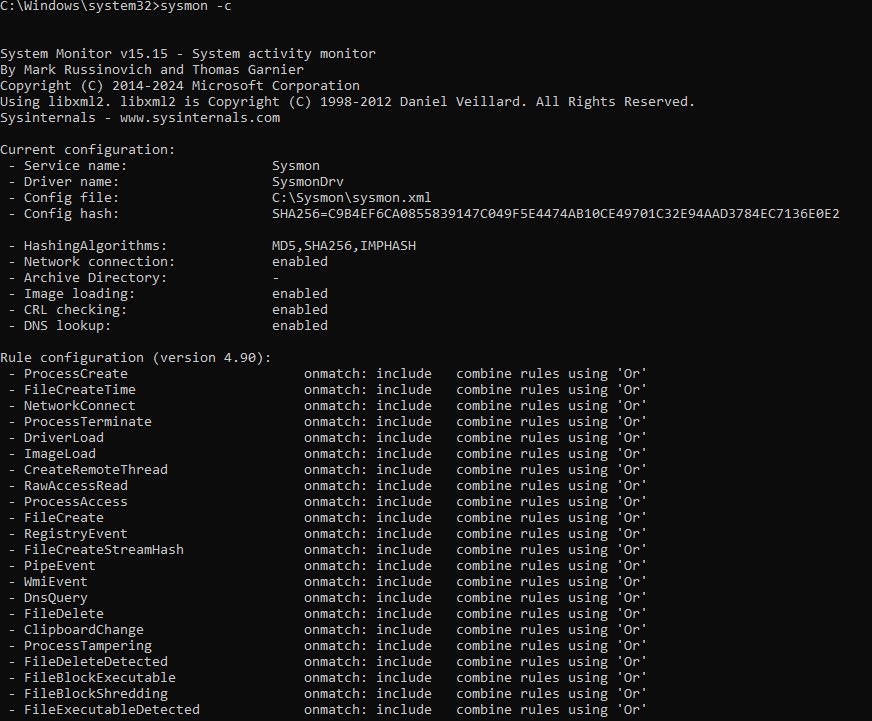

Want to revert it? no problem at all. Just don't quit (the original value saved per execution).
Use the `revert` command, and it will be like never changed:

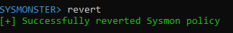

### How to monitor Silent Mode?

Surprise! you can monitor Sysmonster's silent mode with... Sysmon :)
Add this rule to your policy:
```xml
<RuleGroup name="" groupRelation="or">
		<RegistryEvent onmatch="include">
			<TargetObject name="Sysmonster Tampering" condition="begin with">HKLM\SYSTEM\CurrentControlSet\Services\SysmonDrv\Parameters\Rules</TargetObject>		
```

After that, update the configuration with `sysmon -c <new conf>.xml`

And once we will execute the silent mode, it will show the registry event:

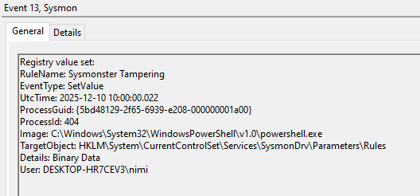

One catch (as you can see) - it does not indicate which specific policy inserted, but powershell.exe that changes this value is suspicious enough :)
(revert action will not be logged!)

---
### Research Process

To support 20+ Sysmon versions, I had to bring more than 20 binaries :))
The perfect location for that is WayBack Machine ;)

Searching for the Sysmon download link brought me a lot of results (and duplicates):


For that, I made two scripts (placed under `silent_mode`) -

`fetch_version.py`:
- Gets all versions from WayBack Machine
- Downloads each version
- Prepares all executables for the second script under `sysmon_versions` directory, named by their timestamps.

`version_analysis.py`:
- Loads each Sysmon binary
- For every Sysmon version, finds the schema and generates empty xml policy
- Loads the empty policy and gets the registry value
- Generates `bytes.txt` that includes the Sysmon version and the registry bytes in powershell-style byte-array
- Generates `sysmon_versions.json` in identical format of the project's json file. 
- Generates `versions.txt` with general information about the versions founded.

#### Usage
```python
cd silent_mode
pip install -r requirements.txt
# For first script - fetch all Sysmon versions
python fetch_versions.py
# For second script - get registry bytes for every version
# Administartor privileges required
python version_analysis.py
```

---
## Project Structure

```
├── src/
│   ├── Sysmonster.ps1: The main entry point and CLI launcher.
│   ├── SysmonsterHelper.psm1:  The CLI/framework core, utility functions and registry DB handler.
│   ├── ProcSysmonster.psm1: Module for all events related to process events (creation, termination, etc.).
│   ├── FileSysmonster.psm1: Module for all events related to file system events (creation, deletion, etc.).
│   └── OtherSysmonster.psm1: Module for other event types (Registry, Network, WMI, etc.).
│
├── silent_mode/
│   ├── version_analysis.py: Sysmon binaries fetcher
│   ├── fetch_versions.py: Generates binary registry data for Sysmonster silent mode.
│
└── data/
    └── sysmon_versions.json: Main json file used by silent mode functionality.
```

---

## Contribution

The tool built in modular architecture, each event function is written in the same structure, so it is very easy to bring on new functionalities and external checks. 
Contributions and suggestions are more than welcome!

--- 
## License

[License](https://github.com/N1mr0ds/Sysmonster/blob/main/LICENSE)

---

## Author

LinkedIn: [Nimrod Shiloh](https://linkedin.com/in/nimrod-shiloh)

---
